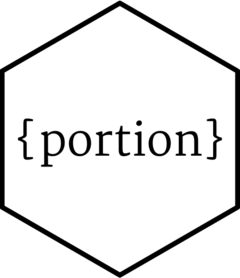

<!-- README.md is generated from README.Rmd. Please edit that file -->

# Extracting a Data Portion 

<!-- badges: start -->

[](https://github.com/loelschlaeger/portion/actions/workflows/R-CMD-check.yaml)
[](https://CRAN.R-project.org/package=portion)
<!-- badges: end -->

`{portion}` is a small R package that allows for extracting a data
portion.

## Installation

You can install the development version of portion from
[GitHub](https://github.com/) with:

``` r
# install.packages("devtools")
devtools::install_github("loelschlaeger/portion")
```

## Example

We can work on a vector:

``` r
portion(1:5, proportion = 0.5)
#> NULL
```

We can work on a matrix:

``` r
portion(diag(3), proportion = 0.5)
#> NULL
```

We can work on a data frame:

``` r
portion(data.frame(1:3, 2:4), proportion = 0.5)
#> NULL
```

We can work on a list:

``` r
portion(list(1:5, diag(3), data.frame(1:3, 2:4)), proportion = 0.5)
#> NULL
```
